# 一、项目背景

中山大学软件工程2015级软件设计综合实训。

# 二、软件分析与设计

## 2.1 问题陈述

大学生家教已经是大学生群体中普遍的一种兼职方式，当下家教行业中一般是以家教机构为中介，这种商业模式依靠从双方客户抽水得到盈利。显然，如果去掉家教机构中介，让需要聘请家教的客户与申请家教兼职的大学生直接对接，可以降低前者的聘教支出和后者的工作收入，为此，需要建立这样一个C2C的平台，让用户直接面谈协商。按照现实模式的需求，请求家教老师的一方只需要表明自己的需要，说清楚自己的学习状况，和期望的家教老师类型，留下联系电话即可，剩余的事务交由家教中介处理；而家教老师需要向机构注册身份，晒出自己的简历，同样留下联系方式，待中介机构分配请求。因此，为了开发一个可以代替机构中介的平台，我们需要将现实中的需求转化成平台的功能。为此，我们做了如下的需求分析和软件设计。

## 2.2 需求分析

### 2.2.1用例图

#### 系统总体的用例图

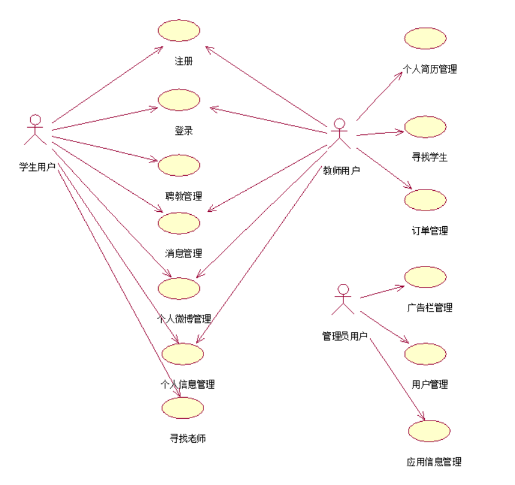

#### 学生用户的用例和子用例

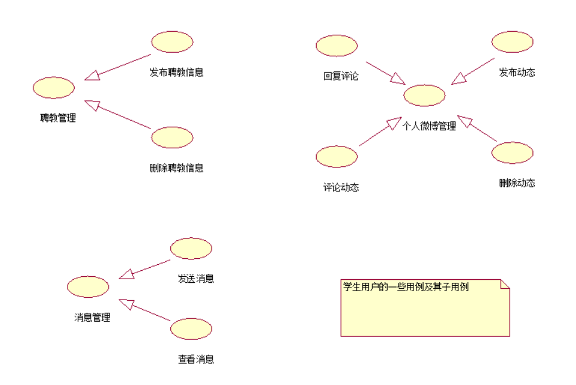

#### 教师用户的部分用例和子用例

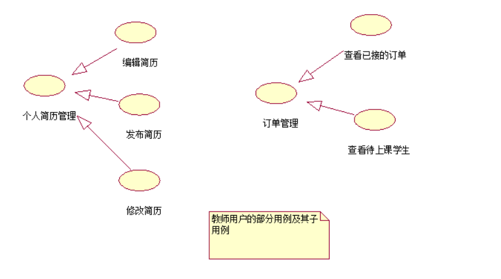

#### 管理员用户的部分用例和子用例

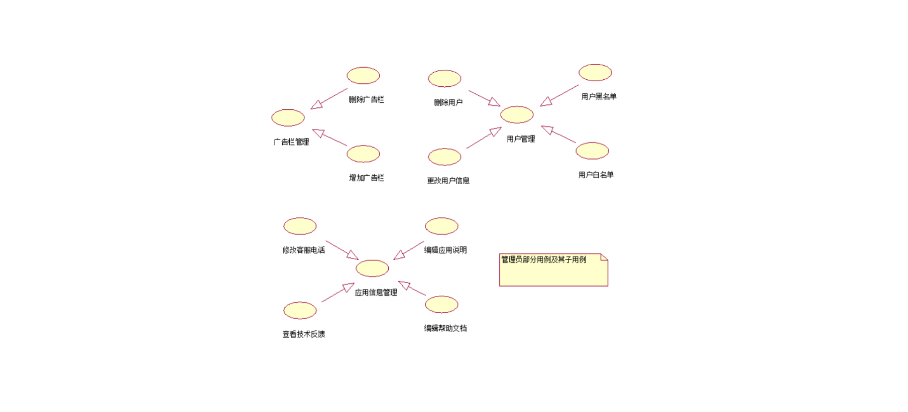

### 2.2.2 用例活动与用例规约

#### 注册用例

##### 注册用例的用例规约

|规约名称         | 规约内容|
|- | -|
|用例名称        | 注册 |
|参与者           | 未注册用户 |
|用例描述         |  用户填写相关信息后注册成功本APP的用户 |
|前置条件         | 无 |
|后置条件         | 顾客按照要求正确填写信息并且用户名可用 |
|补充说明           | 系统检查出用户输入信息不符合规定，返回注册页面，并提示错误原因； 系统检查出用户名不可用，返回注册页面，并提示错误原因； 系统检查出用户填写的密码前后不一致，返回注册页面，并提示错误原因 |

##### 注册用例的活动图

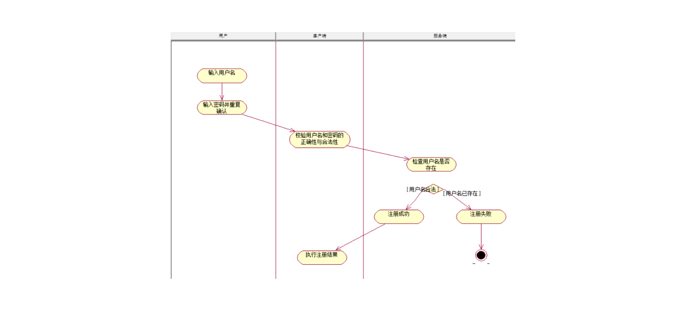

#### 登录用例

##### 登录用例的用例规约

|规约名称         | 规约内容|
|- | -|
|用例名称        | 登录 |
|参与者           | 已注册用户 |
|用例描述         |  用户填写相关信息后登录本APP |
|前置条件         | 无 |
|后置条件         | 顾客按照要求正确填写信息并且用户名和密码匹配 |
|补充说明           | 系统检查出用户输入信息不符合规定，返回登录页面，并提示错误原因； 系统检查出用户名不存在，返回登录页面，并提示错误原因； 系统检查出用户填写的用户名和密码不匹配，返回登录页面，并提示错误原因 |

##### 登录用例的活动图

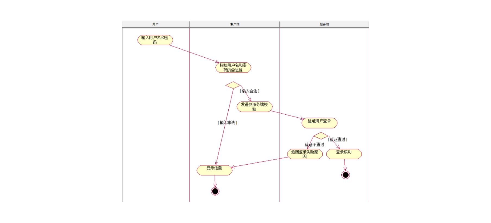

#### 消息发送

##### 消息发送用例的用例规约

|规约名称         | 规约内容|
|- | -|
|用例名称        | 登录 |
|参与者           | 已注册用户 |
|用例描述         |  用户填写相关信息后登录本APP |
|前置条件         | 无 |
|后置条件         | 顾客按照要求正确填写信息并且用户名和密码匹配 |
|补充说明           | 系统检查出用户输入信息不符合规定，返回登录页面，并提示错误原因； 系统检查出用户名不存在，返回登录页面，并提示错误原因； 系统检查出用户填写的用户名和密码不匹配，返回登录页面，并提示错误原因 |

##### 消息发送的活动图

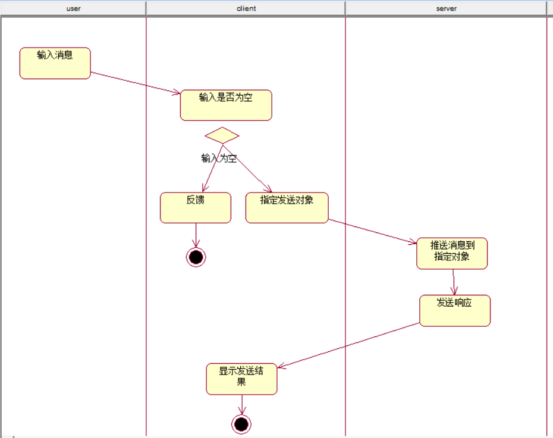

#### 个人微朋友圈管理

##### 个人微朋友圈管理用例的用例规约

|规约名称         | 规约内容 |
|- | -|
|用例名称        | 个人微博管理 |
|参与者           | 已经成功登陆的普通用户 |
|用例描述         | 个人用户发布、删除、评论，点赞发布的帖子 |
|前置条件         | 已经成功登陆 |
|后置条件         | 无 |
|补充说明         | 无。 |

##### 个人微朋友圈管理的活动图

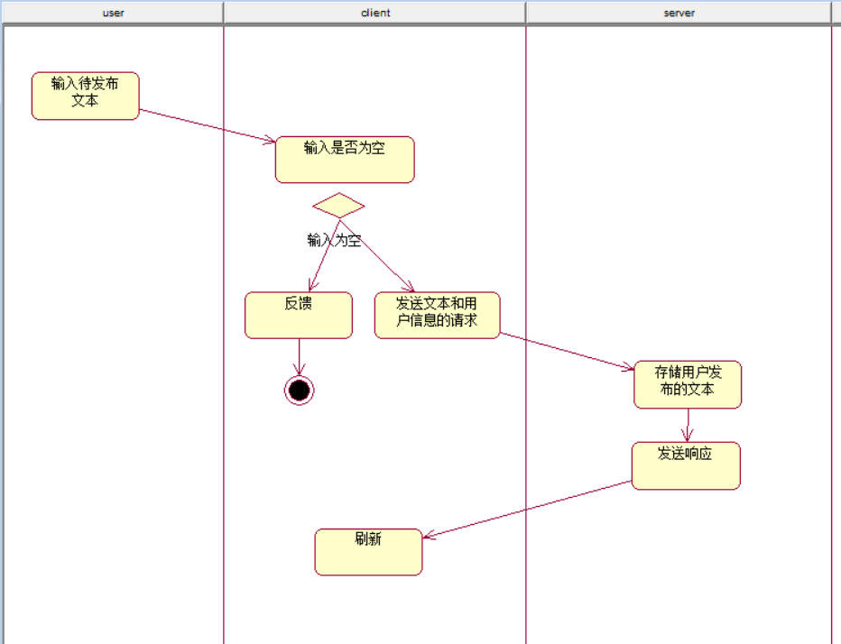

#### 个人信息管理

##### 个人信息修改用例的用例规约

|规约名称         | 规约内容 |
|- | -|
|用例名称        | 个人信息修改 |
|参与者           | 已经成功登陆的普通用户 |
|用例描述         | 个人用户管理个人信息，诸如昵称，性别等 |
|前置条件         | 已经成功登陆 |
|后置条件         | 无 |
|补充说明         | 无。 |

##### 个人信息修改的活动图

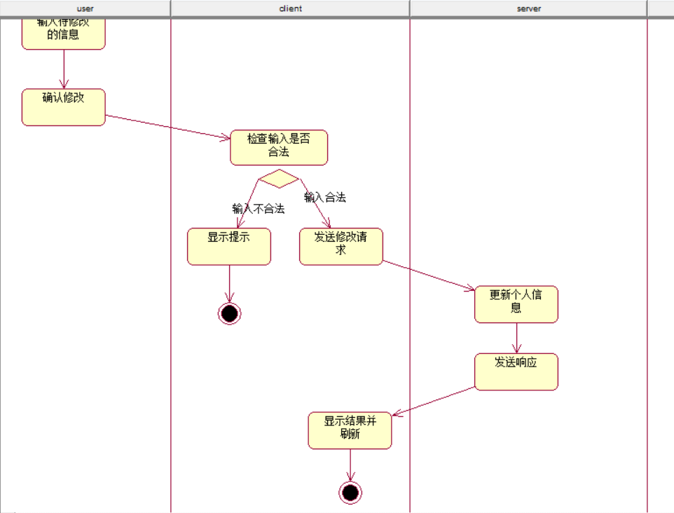

#### 寻找老师

##### 寻找老师的用例规约

|规约名称         | 规约内容 |
|- | -|
|用例名称        | 寻找老师 |
|参与者           | 已注册用户 |
|用例描述         |  该用例旨在描述用户查找所需教师信息的过程 |
|前置条件         | 用户必须是已经注册成功的并且成功登陆的用户 |
|后置条件         | 用户查找的老师必须是注册本APP的老师 |
|补充说明           | 寻找老师的用户必须是注册成功而且登陆的，不然找到也没有用。 如果找到所需要的老师那就可以和老师联系了，如果找不到，那老师界面是空白的。 如果用户没有注册或者登陆，也不能和老师预约。 |

##### 寻找老师用例的活动图

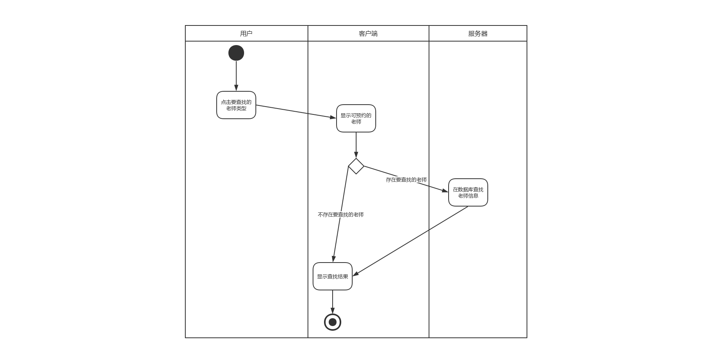

#### 个人简历管理

##### 个人简历修改的用例规约

|规约名称         | 规约内容 |
|- | -|
|用例名称        | 个人简历管理 |
|参与者           | 已注册的学生用户或者教师用户 |
|用例描述         |  该用例描述了如何编辑自己的个人简历 |
|前置条件         | 用户必是注册并且成功登陆的APP用户 |
|后置条件         | 保存用户的个人简历信息，并且对其他用户可见，同时可以不断更新。 |
|补充说明           | 不论是用户查看自己还是查看别人的简历都必须是已经注册的并且成功登陆的用户， 用户只能修改自己的简历，对于其他用户的简历只能查看不能编辑。 |

##### 个人简历修改的活动图

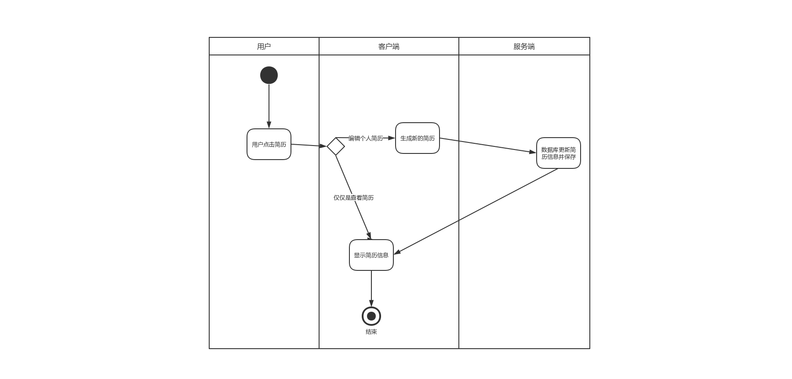

#### 寻找学生

##### 寻找学生的用例规约

|规约名称         | 规约内容 |
|- | -|
|用例名称        | 寻找学生 |
|参与者           | 已经成功注册并登陆的教师用户 |
|用例描述         |  该用例旨在描述教师用户如何查找自己可以辅导的学生用户 |
|前置条件         | 教师用户必须是成功登陆的用户，学生用户也必须是成功注册的用户 |
|后置条件         | 将会显示符合教师用户要求的学生类型 |
|补充说明           | 教师用户必须成功注册并登陆的，可查学生也只是成功注册的学生。 |

##### 寻找学生的活动图

#### 订单管理

##### 订单管理的用例规约

|规约名称         | 规约内容 |
|- | -|
|用例名称        | 订单管理 |
|参与者           | 已经成功登陆的管理员用户 |
|用例描述         |  管理员管理在本APP上发布的家教订单 |
|前置条件         |  已经成功登陆 |
|后置条件         | 无 |
|补充说明         | 无。 |

##### 订单管理的活动图

#### 广告栏管理

##### 广告栏管理的用例规约

|规约名称         | 规约内容 |
|- | -|
|用例名称        | 广告栏管理 |
|参与者           | 已经成功登陆的管理员用户 |
|用例描述         |  管理员管理在本APP首页上轮播图的广告图片 |
|前置条件         |  已经成功登陆 |
|后置条件         | 无 |
|补充说明         | 无。 |

##### 广告栏管理的活动图

#### 用户管理

##### 用户管理的用例规约

|规约名称         | 规约内容 |
|- | -|
|用例名称        | 用户管理 |
|参与者           | 已经成功登陆的管理员用户 |
|用例描述         |  管理员管理在本APP上注册的用户 |
|前置条件         |  已经成功登陆 |
|后置条件         | 无 |
|补充说明         | 无。 |

##### 用户管理的活动图

#### 应用信息管理

##### 应用信息修改的用例规约

|规约名称         | 规约内容 |
|- | -|
|用例名称        | 修改应用信息 |
|参与者           | 已经成功登陆的管理员用户 |
|用例描述         |  管理员修改关于本APP的简介信息 |
|前置条件         |  已经成功登陆 |
|后置条件         | 无 |
|补充说明           | 无。 |

##### 应用信息修改的活动图

### 2.2.4 补充规约

本补充规约的目的是列出不便于在用例规约中列出的系统高需求。补充规约与用例规约一起记录本系统的一整套需求。

- 范围。

    本补充规约适用于本App；

    本规约定义了在许多用例中所共有的功能性需求之外，还定义了系统的非功能性需求，如功能性、可行性、性能、可支持性、安全性和设计约束等。

- 可行性。

本APP与Android5.0以上的手机安卓系统兼容。

- 可靠性。

本系统在每周7天，每天24小时都可以使用。宕机的时间应少于1%。

- 性能。

在既定的任意时刻，系统最多可支持2000名用户同时使用中央数据库，并在任意时刻最多可支持500名用户同时使用本地服务器；
系统必须能够在5秒钟内对用户的请求做出反应。

- 可支持性。

本APP支持Android5.0以上的手机安卓系统。

- 安全性。

系统必须能防止用户查看或修改其他用户的个人信息
系统只允许管理员处理用户信息

- 设计约束。

客户端应用的界面基于主流的Material Design风格进行设计开发

### 2.2.5术语表

表 TutorialApp的部分关键术语

## 2.3架构分析

### 2.3.1 架构描述

客户端应用基于MVP架构、模块化进行搭建和开发。项目分为三层，分别是View层、Presenter层和Model层。该三层具有明显的依赖关系，Presenter层依赖于View层和Model层。

- View层。View层是用户与应用交互的界面，负责获取用户的请求和信息，向用户展示系统操作的结果。

- Presenter层。Presenter层是应用业务的核心，控制管理应用的运行。它负责接收用户的请求和信息，调用Model层的数据操作API，执行系统的业务逻辑操作，并把操作的结果返回给用户。

- Model层。Model层是根据客户端与服务端进行数据交互的需要而封装的操作接口。

### 2.3.2 架构设计

#### TutorialApp客户端的架构

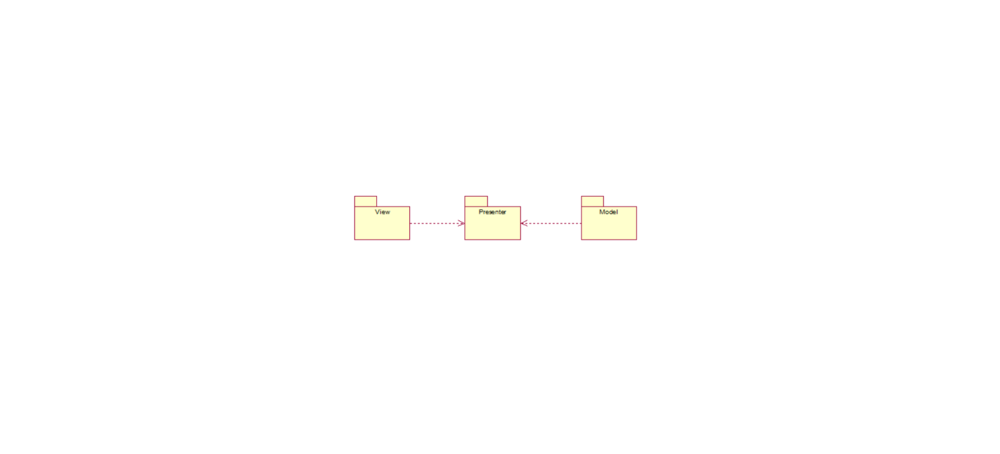

### 2.3.3 Tutorial关键抽象

通过对Tutorial问题陈述、领域知识、数据建模等，得到该系统的关键抽象，即析取出系统的实体类，如图2-xx 所示。

图2-xx TutorialApp项目的关键抽象

## 2.4 TutorialApp 用例分析

### 2.4.1 Tutorial分析类的析取

分析类的析取过程基于用例，从用例中逐渐析取，然后进行分析类的合并。
以“注册用例”为例，得到该用例的分析类UserModel和UserPresenter。图2-xx 为TutorialApp中注册用例的类的设计。

#### TutorialApp中注册用例的类的设计

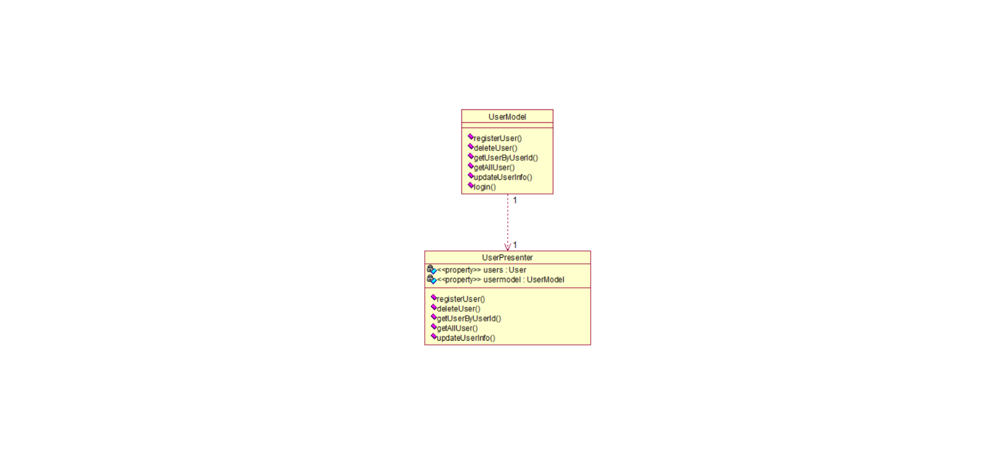

#### TutorialApp项目关键分析类

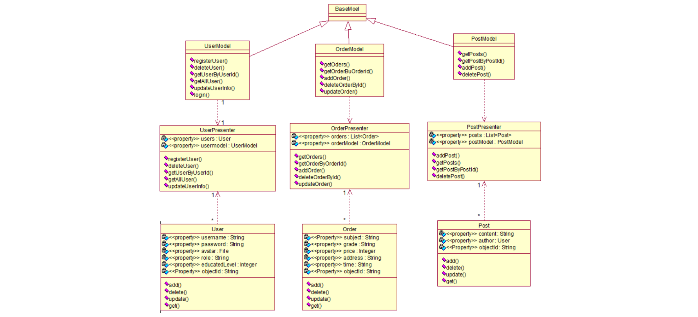

### 2.4.2 TutorialApp分析类机制

表 2-xx TutorialApp关键分析类的分析机制

## 2.5 TutorialApp 子系统设计及子系统中类的设计

在系统框架和关键抽象的基础上，将系统划分为3个逻辑相对独立、功能上相对依赖的子系统，分别是用户管理子系统、订单管理子系统、微博管理子系统。每个管理子系统都包含了MVP三层中对应的类。例如，在用户管理子系统中，包含了视图层的用户登录界面、用户注册界面，表示层包括了用户的输入校验和模型层的UserModel类等。

### 2.5.1 TutorialApp用户管理子系统

用户管理子系统主要的功能包括用户登录、用户注册和用户权限的划分。其中用户权限主要分为一般用户和管理员用户。根据MVP架构，可以将用户管理子系统划分为3个模块。

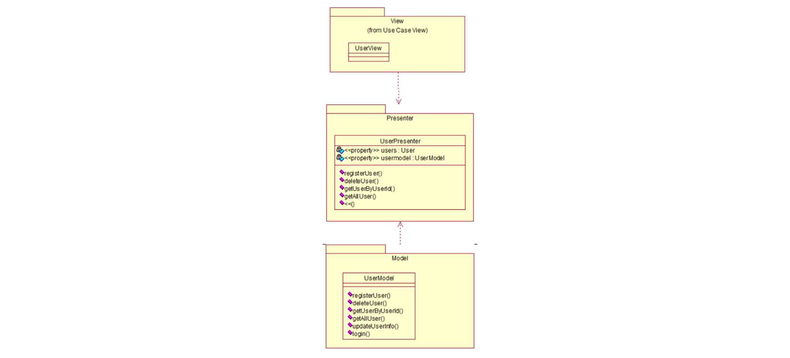

## 2.6 数据库设计

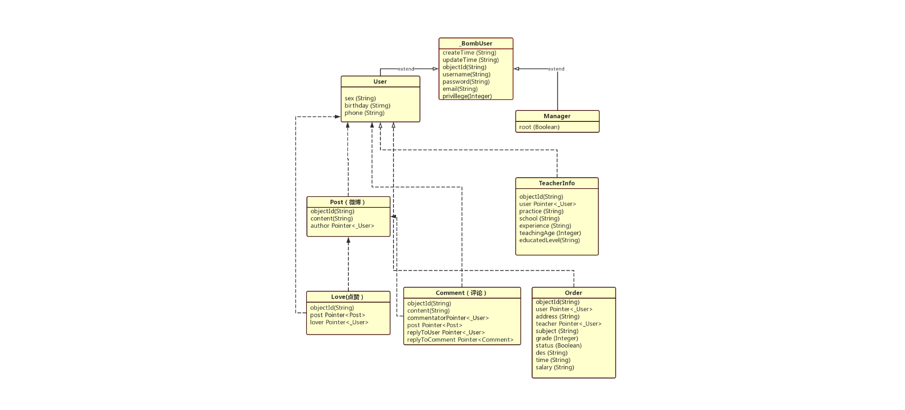
图 2-xx 系统的数据库ER图

## 三、项目评估

### 4.1 完整性

本次综合实训，我小组成员完成了较为完备的软件分析与设计文档，和应用的开发，并简要列出了应用的使用指南。软件的安装和使用状况良好，顺利启动，运行流畅，界面和功能更较为丰富。

### 4.2 可扩展性

技术上的选择。
架构上的设计。
模块化的设计。

### 4.4 可维护性

在软件开发期间完成了完备的关键模型，其中包括用例图、架构图、领域模型和数据库ER图。
项目关键代码都采取了代码注释，功能模块最小化，采用MVP架构避免了部分文件的臃肿冗长，提高了代码的可读性和可维护性。
关于测试用例，（测试代码，测试数据与必要的说明），覆盖关键用例和关键代码

### 4.5 规模系数

本次开发的APP中涉及的用例达到10个以上，代码源文件超过40个，代码总行数超过一万行，软件规模系数的角度看，本次开发的规模系数较高。

## 参考标准

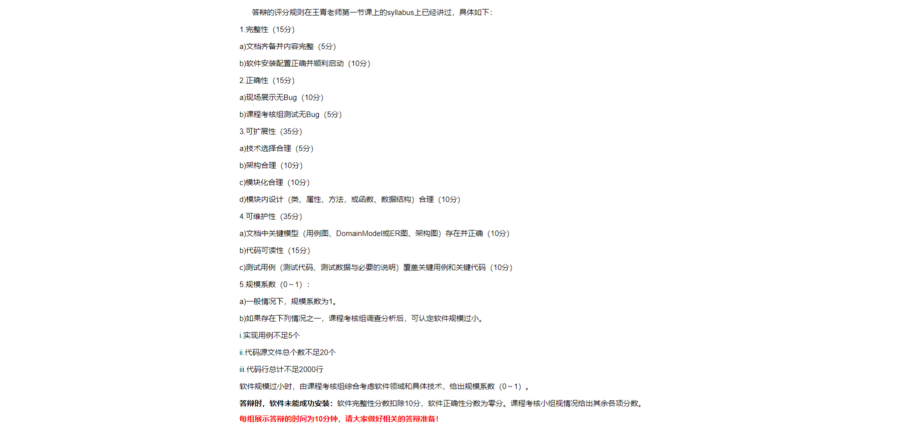