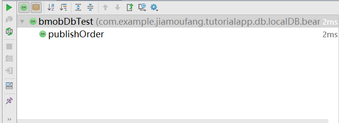

测试主要测试三个比较典型的模块，分别是：注册、登陆、订单发布。
测试使用的方法是Java本地虚拟机的单元测试，这是一种基于`JUnit`实现的测试方法。

## 准备阶段：
添加`JUnit`的依赖：
```
dependencies {
    testCompile 'junit:junit:4.12'
}
```

## 测试阶段：

### 登陆、注册模块

注册的接口设计为输入用户名、密码和确认密码，判断逻辑为如果用户名已经被注册，或者密码和确认密码不一致，则注册失败返回`false`，注册成功则返回`true`，然后比较返回结果是否一致。
登录接口的设计很简单，参数为用户名和密码，如果登陆成功的话实现的接口函数会返回`true`,登陆失败的话返回`false`. 这里我们拿那用户名'sysuygm'和`123`进行测试，比较返回结果。

#### 测试代码：

```
public class UserModelTest {
    UserModel model;
    @Before
    public void setUp() throws Exception {
        model = UserModel.getInstance();
    }
    @Test
    public void login() throws Exception {
        assertEquals("login", true, model.login("sysuygm", "123", new LogInListener() {
            @Override
            public void done(Object o, BmobException e) {}
            @Override
            public void done(Object o, Object o2) {}
        }));
    }

    @Test
    public void register() throws Exception {
        assertEquals("register", true, model.register("sysuygm", "123","123", new LogInListener() {
            @Override
            public void done(Object o, BmobException e) {}
            @Override
            public void done(Object o, Object o2) {}
        }));
    }
}
```

#### 测试结果：测试通过


### 订单发布

订单发布的接口传入的参数为传入一个Order的实例，在测试的时候，想法是分别获取订单发布前后当前学生已发布的订单数，然后比较这两个数字是否存在`f发布前的数量 + 1 = 发布后的数量`这种数学关系。

#### 测试代码：

```
package com.example.jiamoufang.tutorialapp.db.localDB.bean;

import com.example.jiamoufang.tutorialapp.model.UserModel;
import com.example.jiamoufang.tutorialapp.model.bean.Order;

import org.junit.Before;
import org.junit.Test;

import java.util.List;

import cn.bmob.v3.Bmob;
import rx.functions.Action1;

import static org.junit.Assert.*;

/**
 * Created by Administrator on 2018/6/24.
 */
public class bmobDbTest {
    bmobDb instance;
    @Before
    public void setUp() throws Exception {
        instance = bmobDb.getInstance();
    }
    @Test
    public void publishOrder() throws Exception {
        // 获取上传之前的已发布订单数量
        int size1 = instance.findOrderForCurrentStudent().size();
        Order order = new Order();
        order.setAddress("address");
        order.setGrade(2);
        order.setSalary("100");
        order.setSubject("语文");
        order.setEducatedLevel("985本科");
        order.setUser(UserModel.getInstance().getCurrentUser());
        order.setStatus(false);
        // 上传订单
        instance.publishOrder(order);
        // 获取上传之后的已发布订单数量
        int size2 = instance.findOrderForCurrentStudent().size();
        assertEquals(size1+1, size2);
    }
}
```

#### 测试结果：测试通过


