# APP使用说明

### 登陆界面

第一次安装成功后，启动APP进入登录界面。

    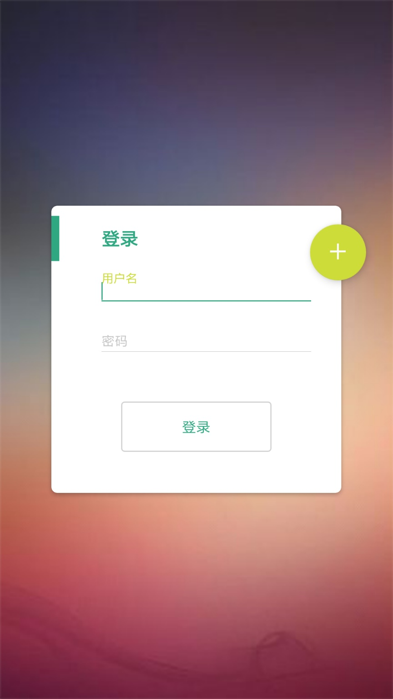

### 注册界面

    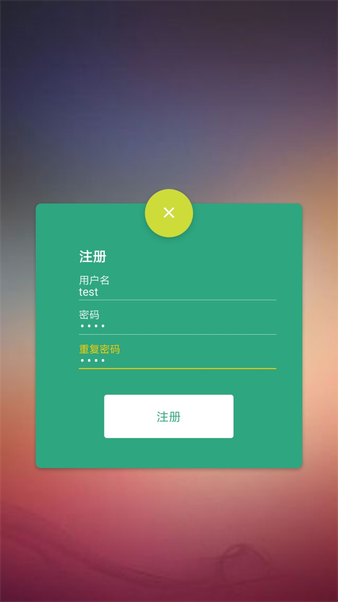

### APP首页

    

### APP首页（续）

    

### 消息界面

    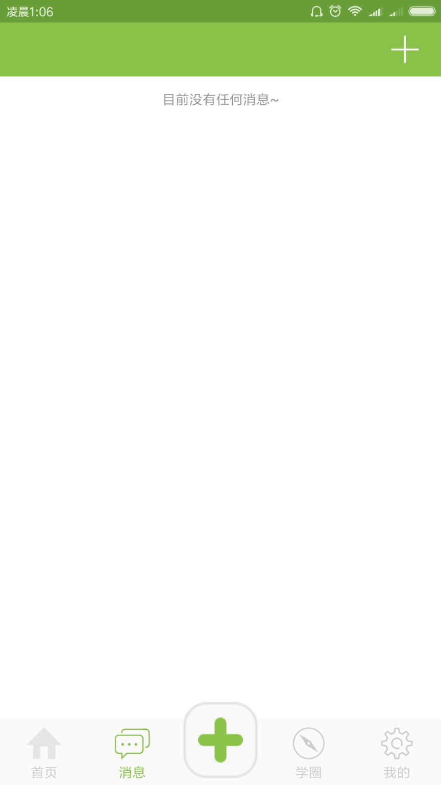

### 陌生人搜索

    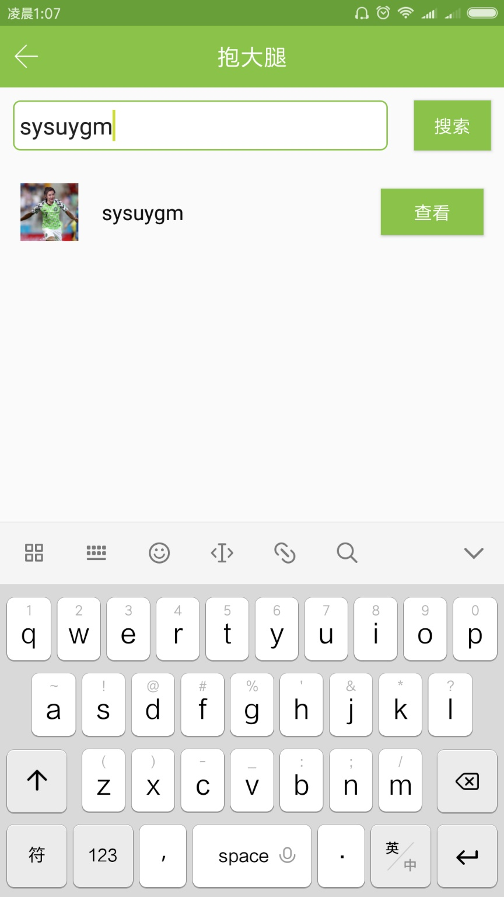

### 陌生人搜索结果页面

    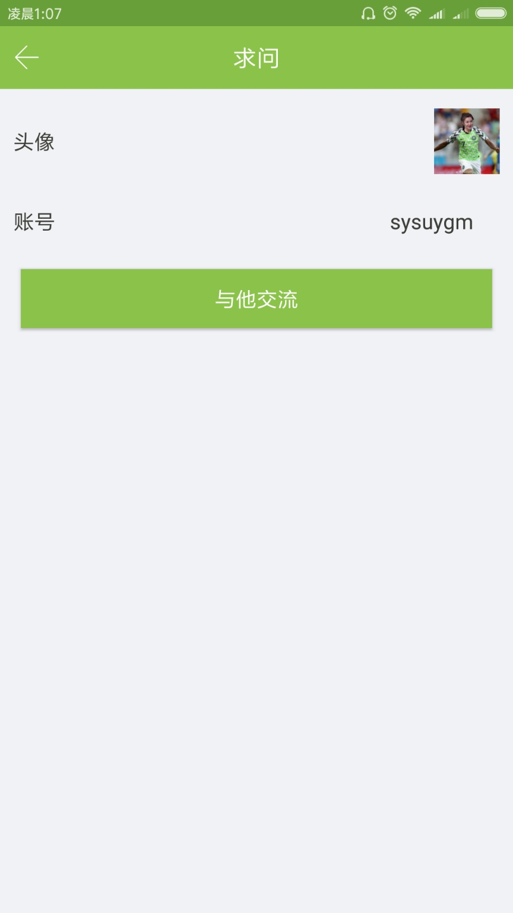

### 陌生人聊天界面

    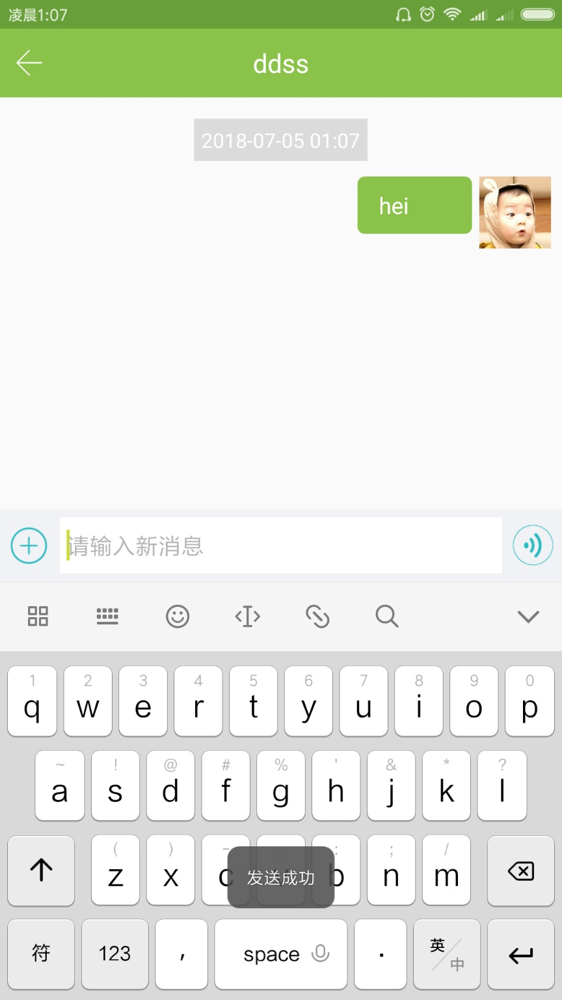

### 消息界面查看消息

    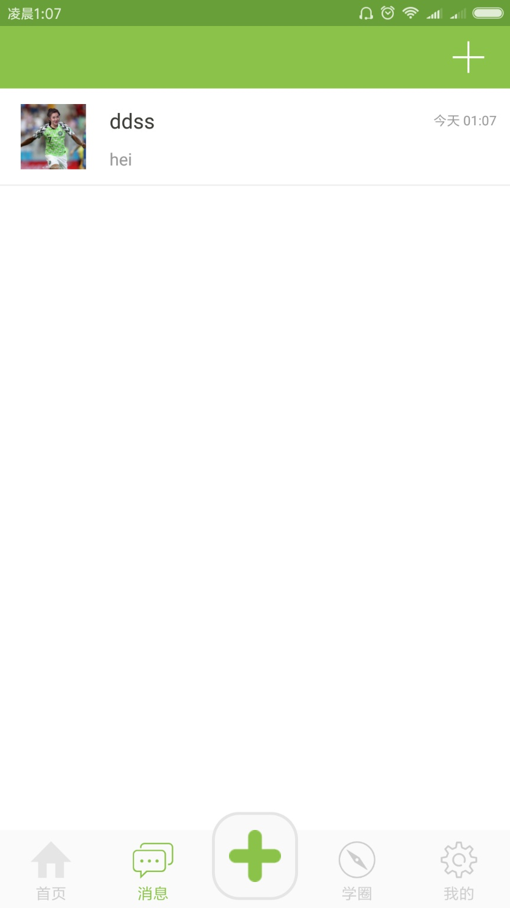

### 发布家教需求

    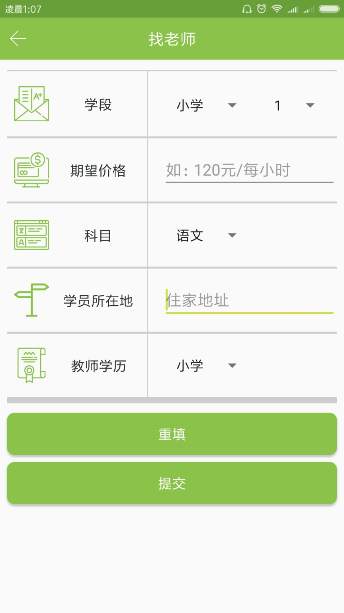

### 寻找学生

    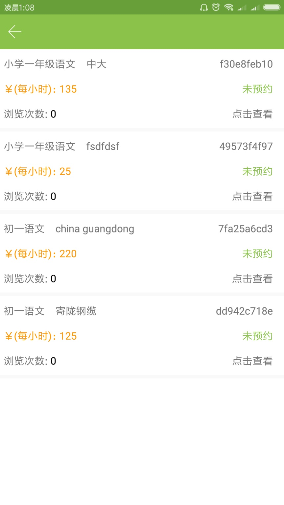

### 寻找老师

    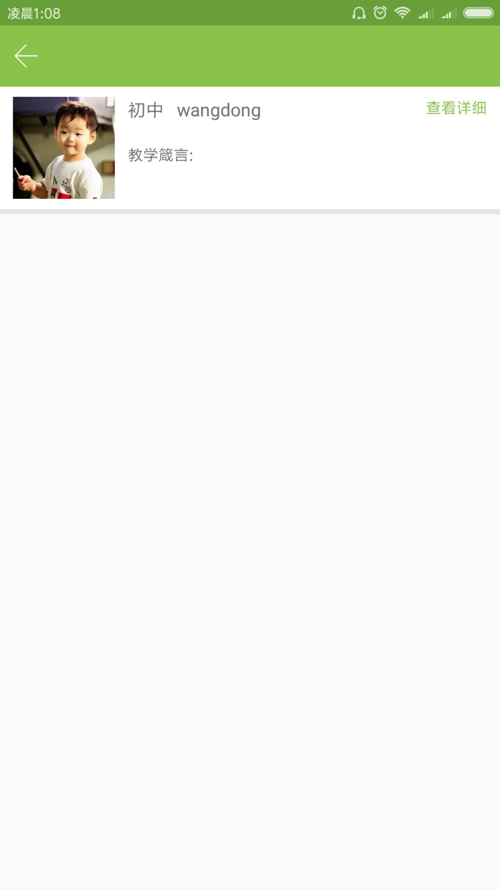

### 查看老师信息

    

### 查看微朋友圈

    

### 发布微朋友圈

    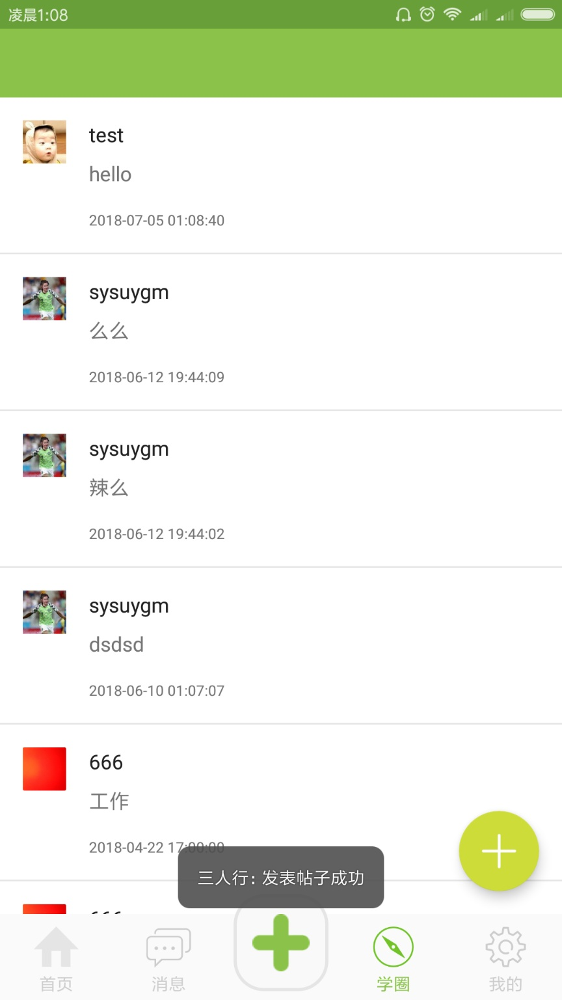

### 微朋友圈的点赞和评论

    

### 填写个人简历

    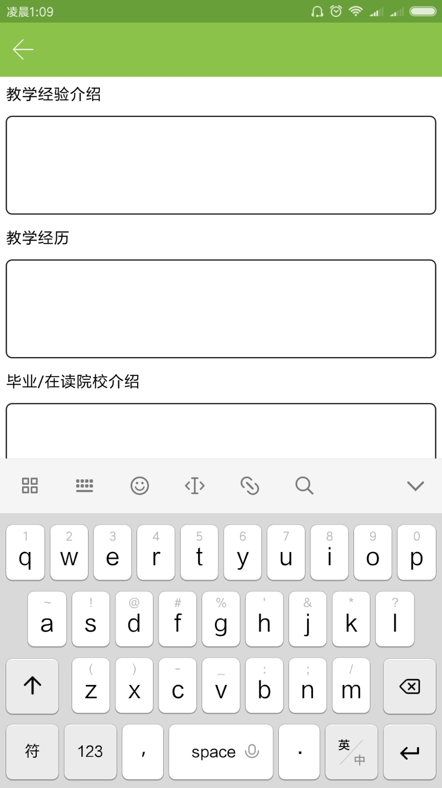

### 个人页面

    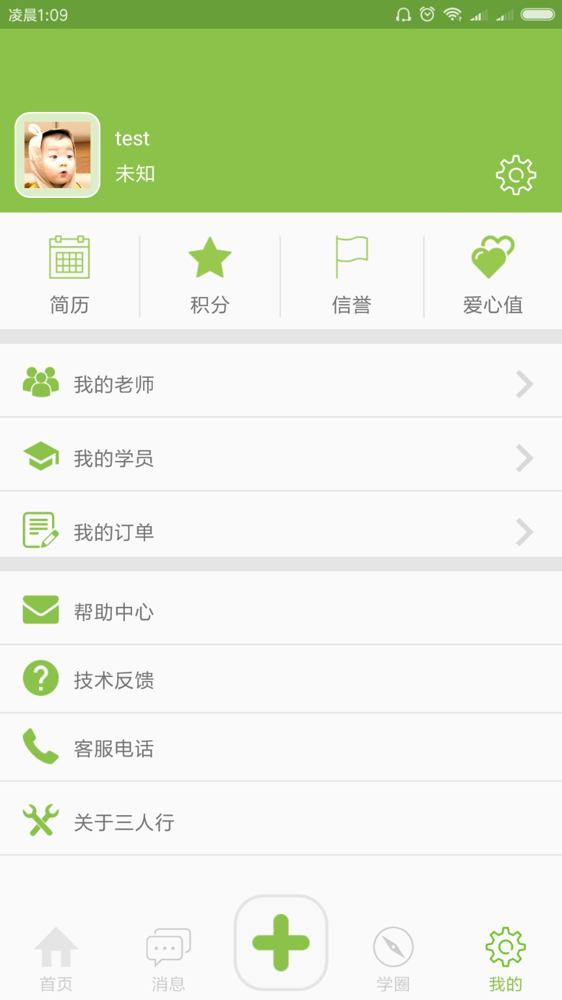

### 个人信息设置

    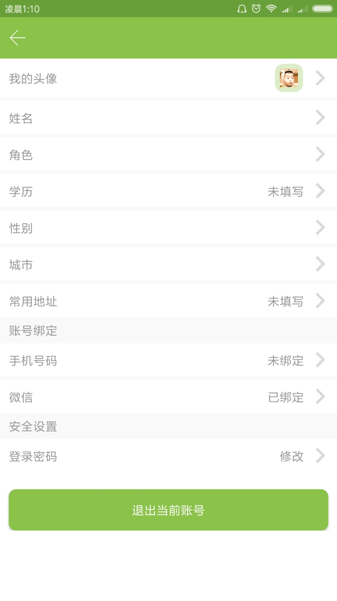

### 切换角色

    

### 选择学历

    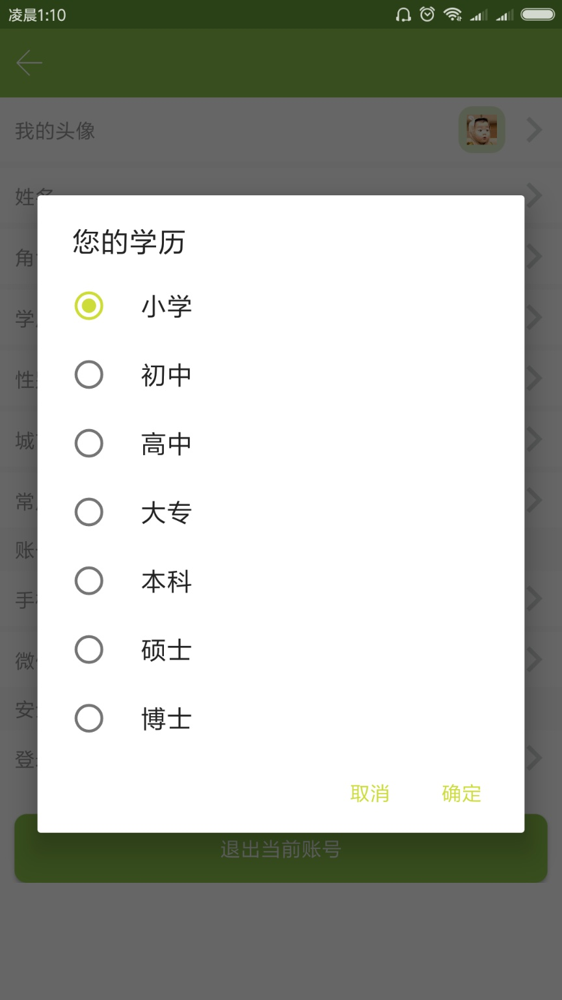

### 寻找老师（查看角色切换是否成功）

    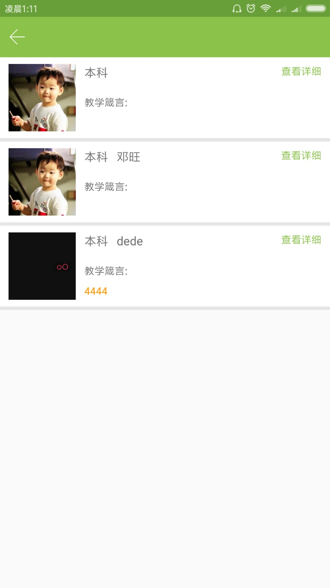

### 寻找老师（查看角色切换是否成功）-查看详细信息

    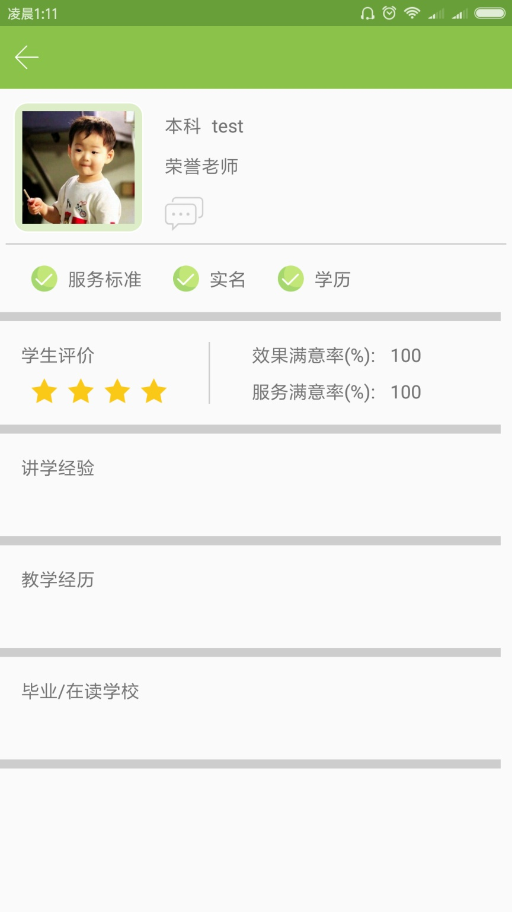

